# Outcry

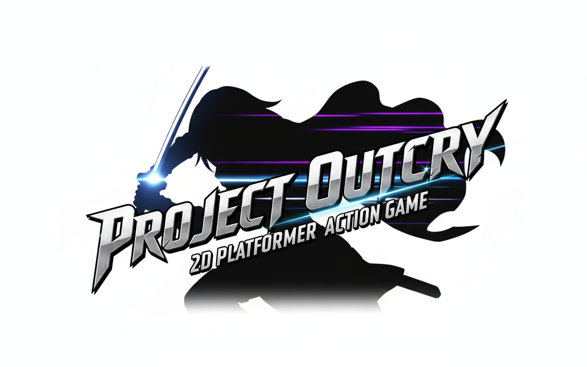

# 📼 플레이 영상


# 🔗 배포 링크
Windows : [Github/Release](https://github.com/Cry4Code/Outcry_public/releases)  
WebGL : [itch.io](https://lhr4426.itch.io/outcry)  


# 🫡 프로젝트 소개

- 'Project OUTCRY'는 전투 중심 PC 2D 액션 게임입니다.
- 화려한 액션과 연출, 그리고 보스 공략의 재미를 선사하는 보스러시 게임을 목표로 개발했습니다.
- 플레이어의 숙련도와 몬스터 패턴 학습을 강조하며, 전투와 보상을 통한 성장( Battle → Reward → Growth )의 핵심 사이클을 제공합니다.
- 랭킹/업적 시스템을 활용해 실패해도 다시 도전하고 싶도록 제작하였습니다.

- 프로젝트 진행 기간 : 2025.09 ~ 2025.11
- [브로셔 링크](https://www.notion.so/teamsparta/4-OutCry-28f2dc3ef51480368d7df187b76bb950)

# 👥 팀원 소개
| 이름 | 담당 | 세부역할 |
| --- | --- | --- |
| 박기훈 | 기획 팀장 | 플레이어/몬스터, 연출 |
| 이혜림 | 개발 팀장 | 플레이어 시스템, 연출 |
| 정지원 | 기획 | 플레이어/몬스터, UI |
| 진영아 | 개발 | 몬스터, 연출 |
| 손건희 | 개발 | 몬스터 |
| 차주원 | 개발 | 유틸리티, 툴, 스테이지 |
| 황상욱 | 개발 | 몬스터, UI, 업적 |


# 📆 프로젝트 일정


| 마일스톤명 | 기간 | 주요 내용 |
| --- | --- | --- |
| 1차 프로토타입 | 09.08 ~ 09.21 | 프레임워크 및 플레이어, 고블린 보스 제작 |
| 2차 프로토타입 (v1.0.0) | 09.22 ~ 10.03 | 플레이어  추가스킬, 첫 번째 보스 특수스킬 및 연출 시스템 구현|
| 3차 프로토타입 (v2.0.0) | 10.13 ~ 10.24 | 신규 몬스터 2종 추가, 인벤토리/상점 구현 |
| 1차 유저 QA | 10.24 ~ 10.27 | 보스 밸런스 + UI/UX + 튜토리얼 미흡 문제 발견  |
| 1차 유저 QA 반영 (v2.1.0) | 10.27 ~ 10.30 | 1차 QA 반영 및 랭킹, 업적 추가 |
| 2차 유저 QA | 10.31 ~ 11.3 | 이펙트, 사운드 빠진 부분 발견 |
| 2차 유저 QA 반영 | 11.3 ~ 11.5 | 2차 QA 반영 |


# 🖥 개발 환경
- Windows 11
- Engine : Unity 2022.3.62f2
- SVC : Github Desktop / Git Fork / SourceTree
- IDE : Visual Studio 2022 / Rider 2025.1.5
- Communiaction : Notion, Jira

# 🧰 기술 스택 

   

    

   

  

# 💻 기술적 도전과 결과

- GoogleSheetToJson 개발을 통한 데이터 관리 파이프라인 구축
- Unity Gaming Service (UGS)를 백엔드 시스템으로 사용함으로써 로그인, 플레이어 데이터 저장, 데이터 분석등을 진행
- 참조 카운팅 기반 ResourceManager 개발로 안정적인 메모리 사용
- Addressable 기반 비동기 로딩
- Behaviour Tree를 사용한 몬스터 AI로 개발 협업 효율 향상
- 이벤트 버스 패턴을 사용해 클래스 간 의존도 감소
- WebGL 플랫폼 빌드 대응

# ⚙ 시스템 구성도
- 와이어프레임


- 플레이어 HFSM 구조도

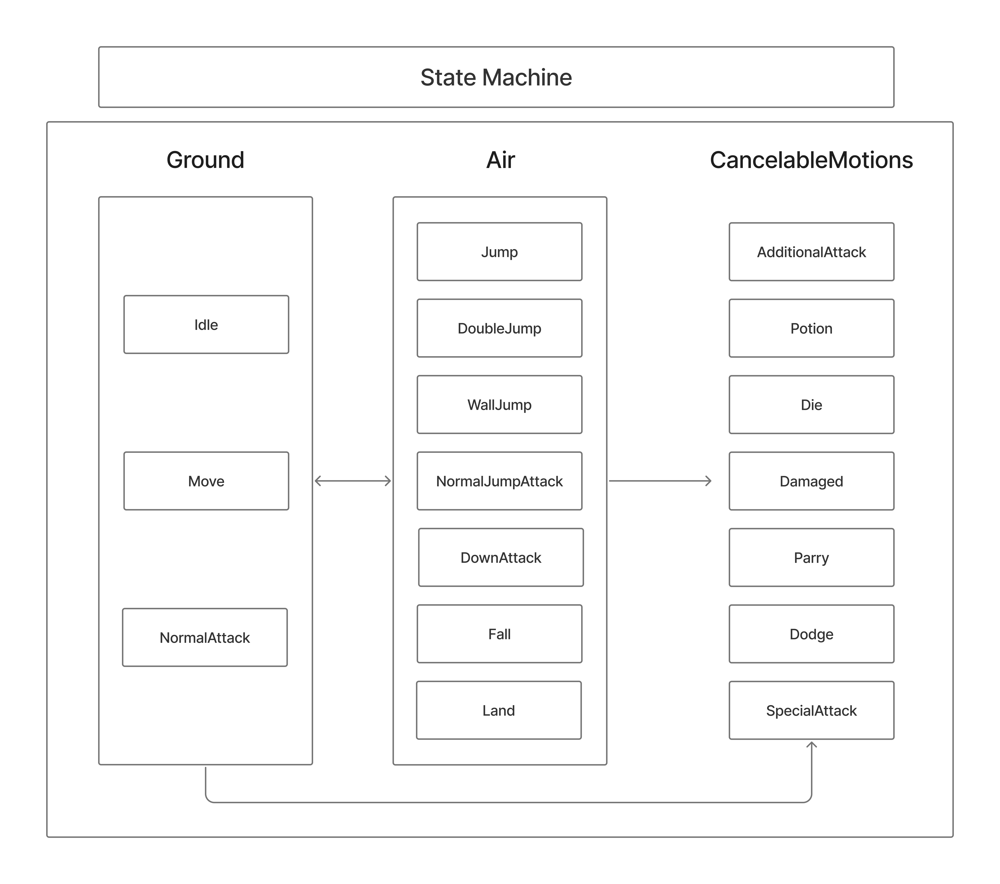

- 몬스터 BT 구조도

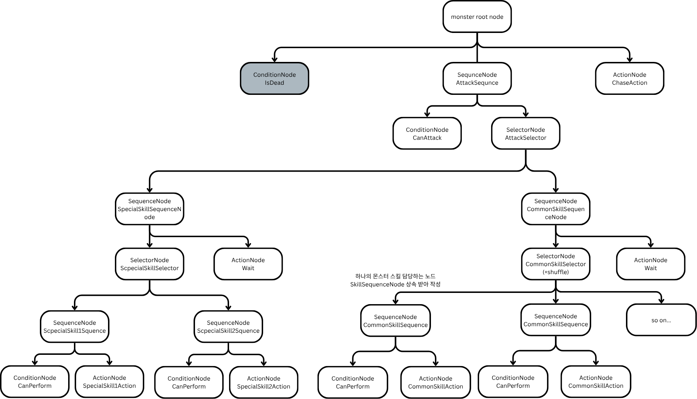

# 📺 화면 구성


| 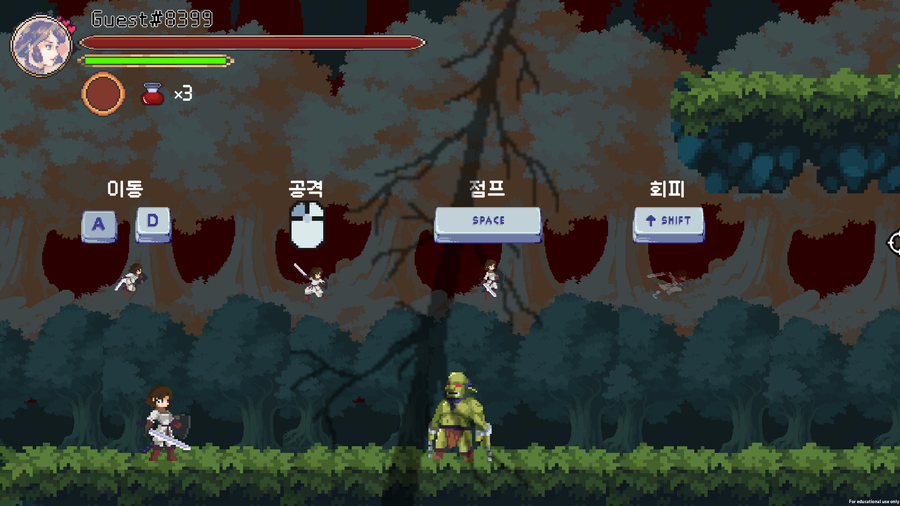 | 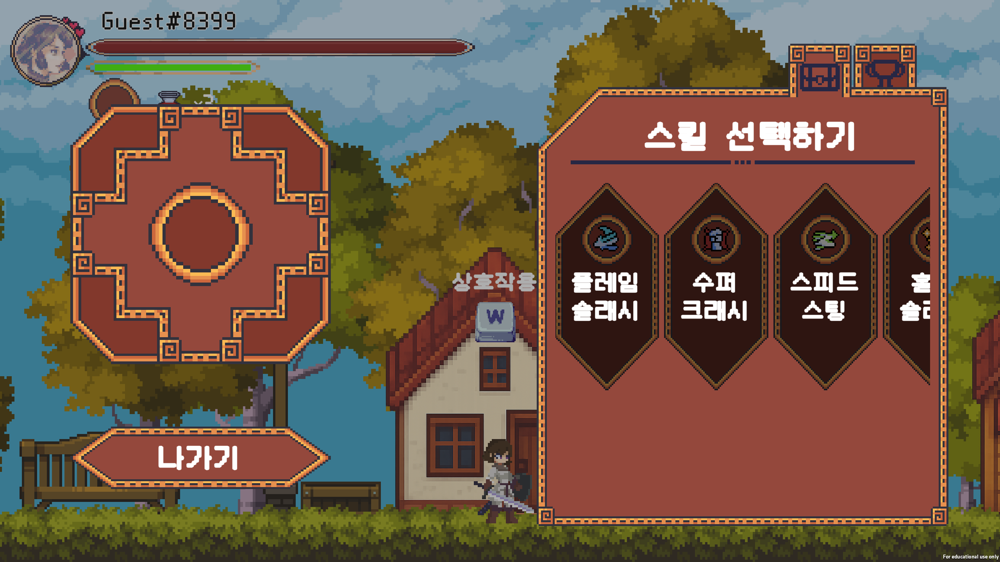 | 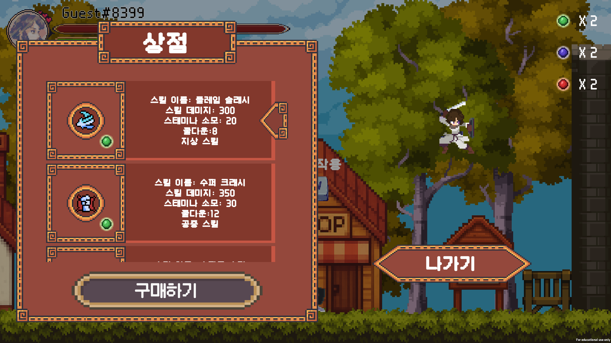 |
| :---: | :---: | :---: |
| 튜토리얼 | 인벤토리 | 상점 |
| 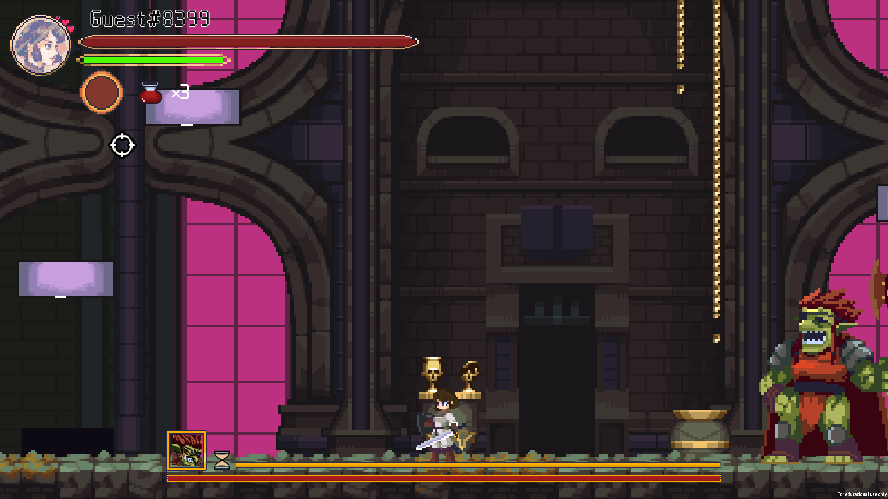 | 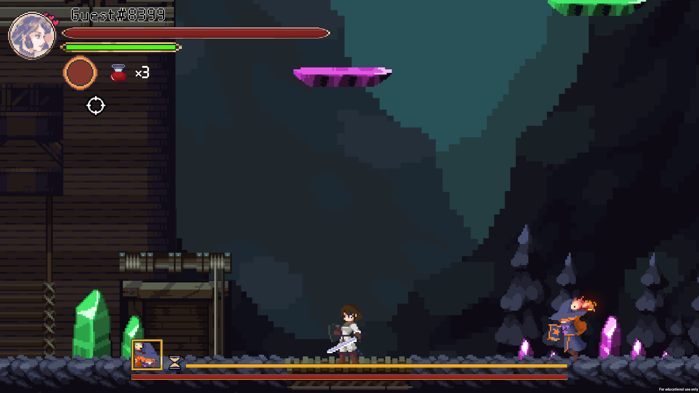 | 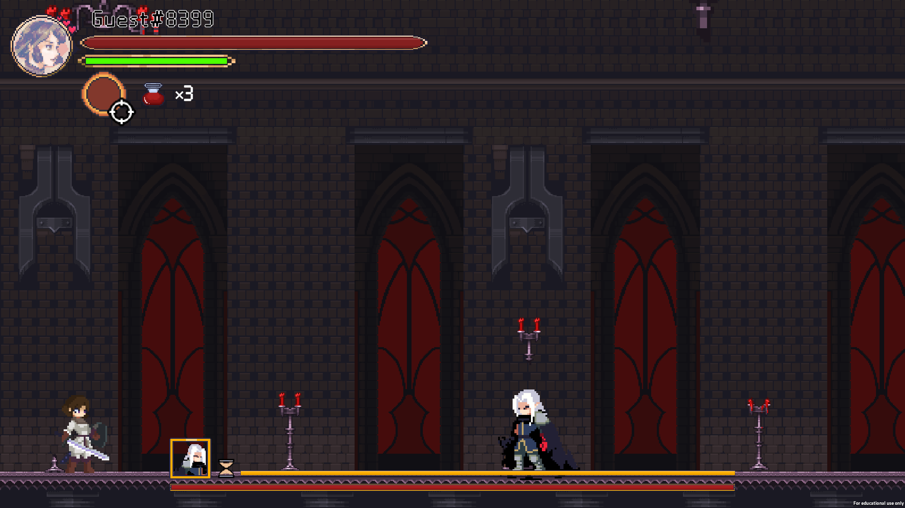 |
| 고블린 킹 (스테이지 1) | 팬텀 위치 (스테이지 2) | 뱀파이어 로드 (스테이지 3) |


# 🛠 주요 기능
## ⚔ 전투 시스템

| 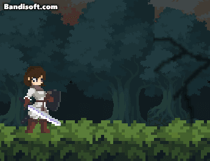 | 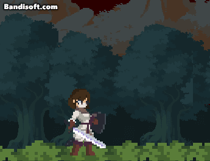 | 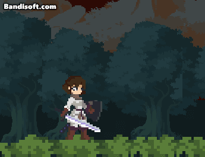 |
| :---: | :---: | :---: |
|기본 공격|공중 공격|공중 하단 공격|


- 스태미나를 소모하는 행동들 

| 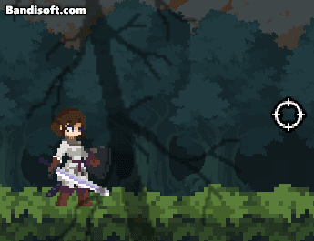 | 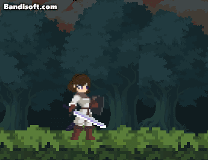 | 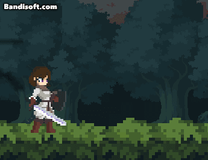 | 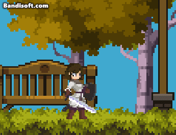 |
| :---: | :---: | :---: | :---: |
| 섬단 | 패링 | 회피 | 추가 스킬 |

- 정확한 타이밍에 맞춰 섬단/패링을 사용하면 체력 회복 or 스태미나 회복 및 몬스터 그로기 상태 진입

| 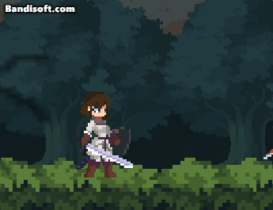 | 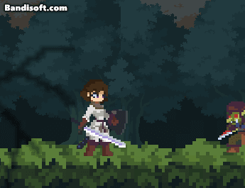 | 
| :---: | :---: |
| 저스트 섬단 | 저스트 패링 | 

- 보스를 처치해 얻은 소울을 통해 새로운 스킬 (총 6종) 구매 가능

| 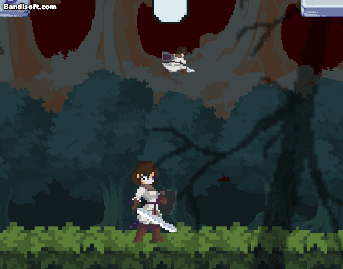 |  | 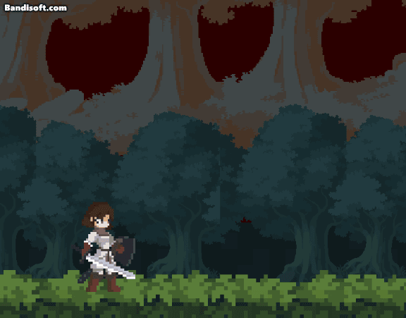 |
| :---: | :---: | :---: |
| 플레임 슬래시 | 수퍼 크래시 | 스피드 스팅 |
| 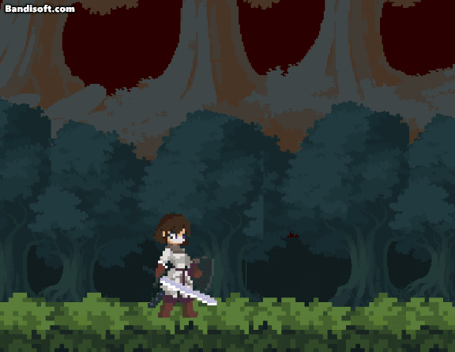 | 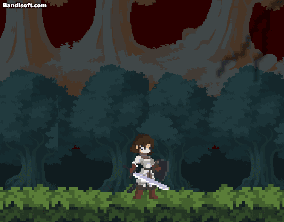 | 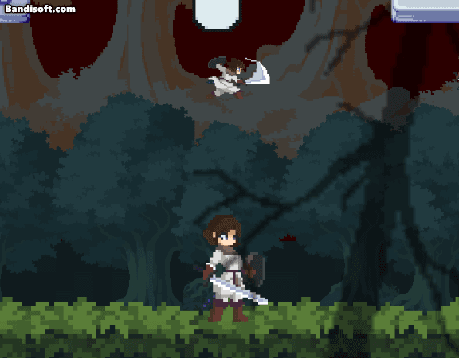 |
| 홀리 슬래시 | 파워 업 | 데드하드 |


## 🪧 리더보드/업적

- 보스별로 클리어 타임을 기록할 수 있는 리더보드

| 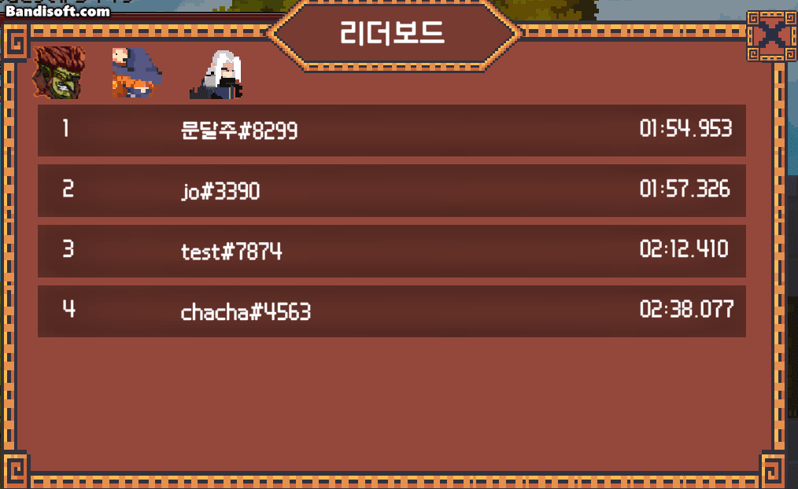 |
| :---: |
|리더보드|


- 다양한 조건으로 구성된 업적  

| 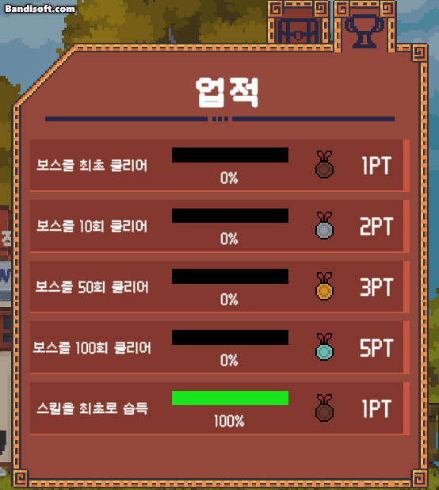 |
| :---: |
|업적|


##  🔥 스테이지 별 각기 다른 패턴

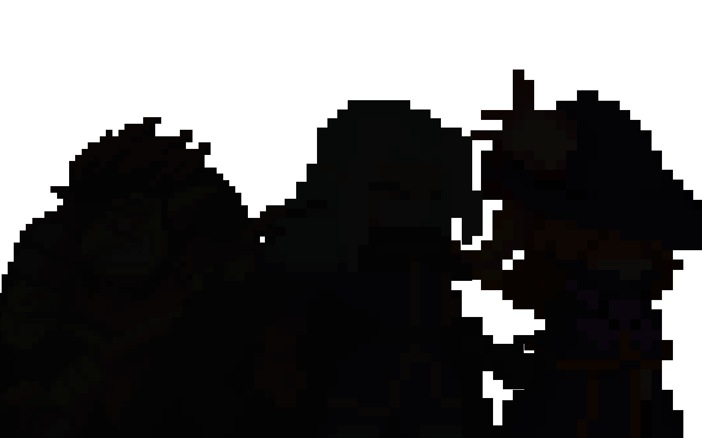

- 보스들마다 색다른 패턴을 구사하도록 제작됨

| 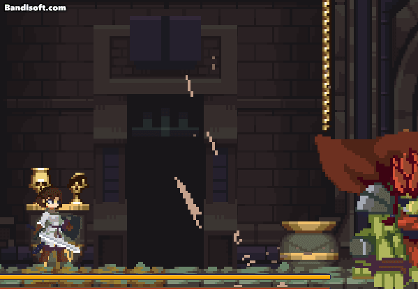 | 
| --- |
| 고블린 킹 : 큰 도끼를 휘두르며 플레이어에게 위압감을 선사 | 
 

| 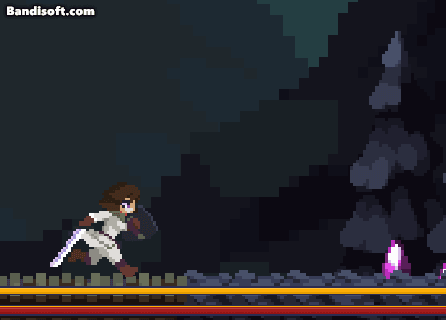 | 
| --- |
| 팬텀 위치 : 귀여운 도마뱀과 함께 원소 마법으로 플레이어를 시도 때도 없이 공격 | 
 

| 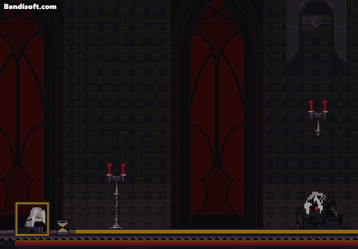 | 
| --- |
| 뱀파이어 로드 : 다양한 투사체와 근접 공격, 기믹으로 플레이어를 괴롭힘 | 
 

# 📂 프로젝트 구조

```
├── 📂 BehaviorTree : BT 공통 구조
│   └── 📂 Base
├── 📂 Common : 상수, 이벤트버스 등 공용 폴더
├── 📂 Data : 외부에서 받은 데이터 변환 및 저장용
│   ├── 📂 Base
│   ├── 📂 Models
│   ├──  📂Monster
│   └── 📂 Player
├── 📂 Effects : 이펙트 매니저에서 사용하는 이펙트
│   ├── 📂 Projectiles
│   └── 📂 SO
│       └── 📂 Base
├── 📂 GeneratedData : GoogleSheetToJson으로 생성된 데이터
├── 📂 Interfaces
├── 📂 Managers
├── 📂 Monsters : 몬스터 AI에 들어가는 노드 포함
│   ├── 📂 Base
│   ├── 📂 BTNodes
│   │   ├── 📂 MoveToTargetNodes
│   │   │   └── 📂 Base
│   │   └── 📂 SkillNodes
│   │       ├── 📂 Base
│   │       ├── 📂 CommonMonster
│   │       │   ├── 📂 GoblinFirekeeper
│   │       │   ├── 📂 GoblinRogue
│   │       │   └── 📂 GoblnFighter
│   │       ├── 📂 GoblinKing
│   │       ├── 📂 PhantomWitch
│   │       └── 📂 VampireLord
│   ├── 📂 ForTest
│   ├── 📂 Models
│   │   └── 📂 Base
│   └── 📂 MonsterAIs
│       ├── 📂 Boss
│       └── 📂 CommonMonster
├── 📂 Player
│   ├── 📂 Base
│   ├── 📂 Effect
│   ├── 📂 PlayerStates : 플레이어 HFSM에 포함되는 상태들
│   │   └── 📂 SubState
│   └── 📂 Skills : Reflection을 활용하는 추가 스킬들
├── 📂 Projectile : 투사체 관련
│   ├── 📂 Base
│   └── 📂 Boss2
├── 📂 Scenes
│   └── 📂 Base
├── 📂 Sound
├── 📂 Stage : 스테이지 내에서 돌아가는 로직들
│   ├── 📂 Common
│   ├── 📂 HallOfBlood
│   │   └── 📂 Marker
│   └── 📂 LobbyVillage
└── 📂 UI : 동적 생성되는 UI들
    ├── 📂 Base
    ├── 📂 LeaderBoard
    ├── 📂 OptionUI
    └── 📂 TutorialPopupUI
```

# 📃 라이센스

MIT © Cry4Code

## 에셋 출처

Sound Effect by Sound Effect by u_fe12rqkbth from Pixabay  
Sound Effect by freesound_community from Pixabay  
Sound Effect by David Dumais from Pixabay  
Sound Effect by yodguard from Pixabay  
Sound Effect by Sunovia from Pixabay  
Sound Effect by EminYILDIRIM from freesound.org (Sound amplified)  
Sound Effect by SilverIllusionist from freesound.org (Sound amplified)  
